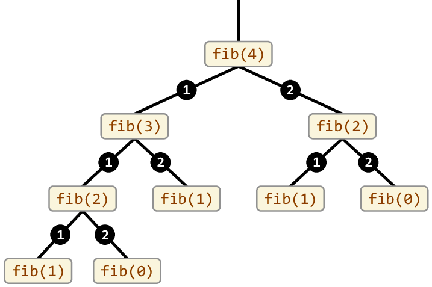

# Crack the Coding Interview - Striver's A2Z DSA Sheet
Practice the following questions to level up your DSA.  
This repository contains solutions for the [Striver's A2Z DSA Sheet](https://takeuforward.org/strivers-a2z-dsa-course/strivers-a2z-dsa-course-sheet-2/) with hints and notes.
<br>

## Learn the Basics:
### Logical Thinking - Pattern Problems
To solve any pattern problem remember these 4 rules:
1. For the outer loop, count the number of lines (rows).
2. For the inner loop, count the number of columns & connect them to rows.
3. Always print the content inside the inner loop
4. For symmetry patterns, implement the upper half first and then the bottom half.

Find the list of all Patterns related problems here: [Pattern Problems](https://takeuforward.org/strivers-a2z-dsa-course/must-do-pattern-problems-before-starting-dsa/)  
Solution to the pattern problems: [Pattern.java](src/main/java/learnthebasics/logicalthinking/Pattern.java)

### Basic Maths
Solution of all the mentioned problems can be found at [BasicMaths.java](src/main/java/learnthebasics/basicmaths/BasicMaths.java)
#### 1. Number Of Digits
Problem: [Number of Digits](https://www.codingninjas.com/studio/problems/number-of-digits_4538242)   
Approach -  
* BruteForce: TC = O(log10(N)) & SC = O(1)
  * Divide the number by 10 until it is 0
  * Increment the count in every division
  * Return count
* Optimal: TC = O(1) & SC = O(1)
  * Use `Math.ceil(Math.log10(x+1))` to find the number of digits.

#### 2. Reverse Integer
Problem: [Reverse Integer](https://leetcode.com/problems/reverse-integer/)  
Approach:
* Optimal: TC = O(log10(N)) & SC = O(1)
  * Extract a digit using Modulo
  * Shift the result to left by 1 place and add the extracted digit.

#### 3. Palindrome Integer
Problem: [Palindrome Integer](https://practice.geeksforgeeks.org/problems/palindrome0746/1)  
Approach:   
* Optimal: TC = O(log10(N)) & SC = O(1)
  * Reverse the number and compare it with the original number
  * To reverse use the 2nd problem's logic

#### 4. Armstrong Numbers
Problem: [Armstrong Numbers](https://practice.geeksforgeeks.org/problems/armstrong-numbers2727/1)  
Approach:
* Optimal: TC = O(log10(N)) & SC O(1)
  * Extract a digit and use `Math.pow()` to find the cube

#### 5. Number Of Factors
Problem: [Number Of Factors](https://practice.geeksforgeeks.org/problems/number-of-factors1435/1)  
Approach:
* Bruteforce: TC = O(N) & SC = O(1)
  * Need to traverse from 1 to N and see if the number is a factor
* Optimal: TC = O(Sqrt(N)) & SC = O(1)
  * We don't need to go till N to find number of factors 
  * We only need to go till Sqrt(N).

#### 6. Prime Number
Problem: [Prime Number](https://practice.geeksforgeeks.org/problems/prime-number2314/1)  
Approach:
* Bruteforce: TC = O(N) & SC = O(1)
  * Need to traverse from 2 to N and check if the number is divisible
* Optimal: TC = O(Sqrt(N)) & SC = O(1)
  * We only need to traverse till Sqrt(N)

#### 7. LCM and GCD
Problem: [LCM and GCD](https://practice.geeksforgeeks.org/problems/lcm-and-gcd4516/1)  
Example: 
* LCM(14, 8) = 56. Since 56 is the least number that is divisible by both 14 & 8
* GCD(14, 8) = 2. Since 2 divides both 14 and 8.
Approach:
* Bruteforce: TC = O(A*B) & SC = O(1)
  * Find LCM: Start from max of A or B till (A*B) and check if you encounter a number divisible by both A and B
  * Find GCD: Start from 1 till min(A, B)
* Better:
  * Find GCD first then use the formula LCM = (A*B)/GCD
* Optimal:
  * Use Euclidean theorem to find GCD: GCD(A, B) = GCD(A-B, B) where A > B, till one of them becomes 0 then the other is GCD, use GCD in the formula to find LCM.
* Best:
  * Use improved euclidean theorem to find GCD: GCD(A%B, B) where A > B, then use the same approach as optimal

### Recursion
> When a function calls itself until a base condition is met is called Recursion.

#### Stack Overflow
When a function is called it is pushed onto the stack. When the function has finished executing it gets popped up from the stack.  
If a function is called recursively without a base condition then the function is pushed onto the stack until stack memory runs out resulting in Stack overflow.

<mark>Always provide a base condition while writing recursive code,</mark> otherwise it can result into stack overflow.

#### Recursion Tree
It is a graphical representation of recursion calls in a form of tree.   
Example recursion tree for fibonacci series.  



#### Pattern to Solve recursion
1. Parameterized - The function prints the value.

```java
public class BasicRecursion {
    public static void main(String[] args) {
        function(5, 0);
    }

    static void function(int i, int sum) {
        if (i < 1) {
            System.out.print(sum);
            return;
        }
        function(i-1, sum+i);
    }
}
```

2. Functional - The function returns the value.
```java
public class BasicRecursion {
    public static void main(String[] args) {
        System.out.println(sumOfSeries(5));
    }

    static int sumOfSeries(int n) {
        if (n == 0) return 0;
        int sum = n + sumOfSeries(--n);
        return sum;
    }
}
```
#### Problems:
Solution to all the recursion problems can be found at [Recursion.java](src/main/java/learnthebasics/recursion/Recursion.java)
1. [Print 1 To N Without Loop](https://practice.geeksforgeeks.org/problems/print-1-to-n-without-using-loops-1587115620/1) -  TC = O(N) & SC = O(N)
2. [Print GFG n times](https://practice.geeksforgeeks.org/problems/print-gfg-n-times/1) - TC = O(N) & SC = O(N)
3. [Print N to 1 without loop](https://practice.geeksforgeeks.org/problems/print-n-to-1-without-loop/1) - TC = O(N) & SC = O(N)
4. [Sum of first n terms](https://practice.geeksforgeeks.org/problems/sum-of-first-n-terms5843/1) - TC = O(N) & SC = O(N)
5. [Factorial](https://practice.geeksforgeeks.org/problems/factorial5739/1) - TC = O(N) & SC = O(N)
6. [Palindrome String](https://practice.geeksforgeeks.org/problems/palindrome-string0817/1) -  TC = O(N) & SC = O(N)
7. [Fibonacci Number - LeetCode](https://leetcode.com/problems/fibonacci-number/submissions/973184456/) - TC = O(2^N) & SC = O(N)

In recursive algorithms, space complexity is `O(n)` where n is the depth of the recursion tree. If each recursion call takes `O(m)` SC then the total SC would become `O(n*m)`.  
TC is `O(n)` because the recursion tree is linear. In case of fibonacci almost each node has 2 children making it a binary recursion tree, hence the TC of fibonacci is `O(2^N)`.
