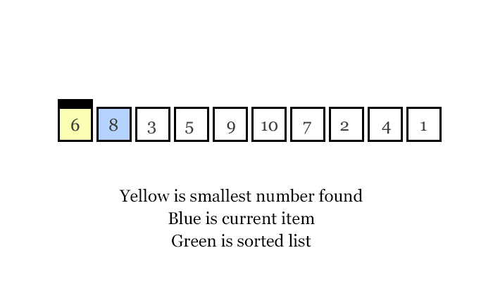

# Crack the Coding Interview - Striver's A2Z DSA Sheet
Practice the following questions to level up your DSA.  
This repository contains solutions for the [Striver's A2Z DSA Sheet](https://takeuforward.org/strivers-a2z-dsa-course/strivers-a2z-dsa-course-sheet-2/) with hints and notes.
<br>

## Learn the Basics:
### Logical Thinking - Pattern Problems
To solve any pattern problem remember these 4 rules:
1. For the outer loop, count the number of lines (rows).
2. For the inner loop, count the number of columns & connect them to rows.
3. Always print the content inside the inner loop
4. For symmetry patterns, implement the upper half first and then the bottom half.

Find the list of all Patterns related problems here: [Pattern Problems](https://takeuforward.org/strivers-a2z-dsa-course/must-do-pattern-problems-before-starting-dsa/)  
Solution to the pattern problems: [Pattern.java](src/main/java/learnthebasics/logicalthinking/Pattern.java)

### Basic Maths
Solution of all the mentioned problems can be found at [BasicMaths.java](src/main/java/learnthebasics/basicmaths/BasicMaths.java)
#### 1. Number Of Digits
Problem: [Number of Digits](https://www.codingninjas.com/studio/problems/number-of-digits_4538242)   
Approach -  
* BruteForce: TC = O(log10(N)) & SC = O(1)
  * Divide the number by 10 until it is 0
  * Increment the count in every division
  * Return count
* Optimal: TC = O(1) & SC = O(1)
  * Use `Math.ceil(Math.log10(x+1))` to find the number of digits.

#### 2. Reverse Integer
Problem: [Reverse Integer](https://leetcode.com/problems/reverse-integer/)  
Approach:
* Optimal: TC = O(log10(N)) & SC = O(1)
  * Extract a digit using Modulo
  * Shift the result to left by 1 place and add the extracted digit.

#### 3. Palindrome Integer
Problem: [Palindrome Integer](https://practice.geeksforgeeks.org/problems/palindrome0746/1)  
Approach:   
* Optimal: TC = O(log10(N)) & SC = O(1)
  * Reverse the number and compare it with the original number
  * To reverse use the 2nd problem's logic

#### 4. Armstrong Numbers
Problem: [Armstrong Numbers](https://practice.geeksforgeeks.org/problems/armstrong-numbers2727/1)  
Approach:
* Optimal: TC = O(log10(N)) & SC O(1)
  * Extract a digit and use `Math.pow()` to find the cube

#### 5. Number Of Factors
Problem: [Number Of Factors](https://practice.geeksforgeeks.org/problems/number-of-factors1435/1)  
Approach:
* Bruteforce: TC = O(N) & SC = O(1)
  * Need to traverse from 1 to N and see if the number is a factor
* Optimal: TC = O(Sqrt(N)) & SC = O(1)
  * We don't need to go till N to find number of factors 
  * We only need to go till Sqrt(N).

#### 6. Prime Number
Problem: [Prime Number](https://practice.geeksforgeeks.org/problems/prime-number2314/1)  
Approach:
* Bruteforce: TC = O(N) & SC = O(1)
  * Need to traverse from 2 to N and check if the number is divisible
* Optimal: TC = O(Sqrt(N)) & SC = O(1)
  * We only need to traverse till Sqrt(N)

#### 7. LCM and GCD
Problem: [LCM and GCD](https://practice.geeksforgeeks.org/problems/lcm-and-gcd4516/1)  
Example: 
* LCM(14, 8) = 56. Since 56 is the least number that is divisible by both 14 & 8
* GCD(14, 8) = 2. Since 2 divides both 14 and 8.
Approach:
* Bruteforce: TC = O(A*B) & SC = O(1)
  * Find LCM: Start from max of A or B till (A*B) and check if you encounter a number divisible by both A and B
  * Find GCD: Start from 1 till min(A, B)
* Better:
  * Find GCD first then use the formula LCM = (A*B)/GCD
* Optimal:
  * Use Euclidean theorem to find GCD: GCD(A, B) = GCD(A-B, B) where A > B, till one of them becomes 0 then the other is GCD, use GCD in the formula to find LCM.
* Best:
  * Use improved euclidean theorem to find GCD: GCD(A%B, B) where A > B, then use the same approach as optimal

### Recursion
> When a function calls itself until a base condition is met is called Recursion.

#### Stack Overflow
When a function is called it is pushed onto the stack. When the function has finished executing it gets popped up from the stack.  
If a function is called recursively without a base condition then the function is pushed onto the stack until stack memory runs out resulting in Stack overflow.

<mark>Always provide a base condition while writing recursive code,</mark> otherwise it can result into stack overflow.

#### Recursion Tree
It is a graphical representation of recursion calls in a form of tree.   
Example recursion tree for fibonacci series.  


#### Pattern to Solve recursion
1. Parameterized - The function prints the value.

```java
public class BasicRecursion {
    public static void main(String[] args) {
        function(5, 0);
    }

    static void function(int i, int sum) {
        if (i < 1) {
            System.out.print(sum);
            return;
        }
        function(i-1, sum+i);
    }
}
```

2. Functional - The function returns the value.
```java
public class BasicRecursion {
    public static void main(String[] args) {
        System.out.println(sumOfSeries(5));
    }

    static int sumOfSeries(int n) {
        if (n == 0) return 0;
        int sum = n + sumOfSeries(--n);
        return sum;
    }
}
```
#### Problems:
Solution to all the recursion problems can be found at [Recursion.java](src/main/java/learnthebasics/recursion/Recursion.java)
1. [Print 1 To N Without Loop](https://practice.geeksforgeeks.org/problems/print-1-to-n-without-using-loops-1587115620/1) -  TC = O(N) & SC = O(N)
2. [Print GFG n times](https://practice.geeksforgeeks.org/problems/print-gfg-n-times/1) - TC = O(N) & SC = O(N)
3. [Print N to 1 without loop](https://practice.geeksforgeeks.org/problems/print-n-to-1-without-loop/1) - TC = O(N) & SC = O(N)
4. [Sum of first n terms](https://practice.geeksforgeeks.org/problems/sum-of-first-n-terms5843/1) - TC = O(N) & SC = O(N)
5. [Factorial](https://practice.geeksforgeeks.org/problems/factorial5739/1) - TC = O(N) & SC = O(N)
6. [Palindrome String](https://practice.geeksforgeeks.org/problems/palindrome-string0817/1) -  TC = O(N) & SC = O(N)
7. [Fibonacci Number - LeetCode](https://leetcode.com/problems/fibonacci-number/submissions/973184456/) - TC = O(2^N) & SC = O(N)

In recursive algorithms, space complexity is `O(n)` where n is the depth of the recursion tree. If each recursion call takes `O(m)` SC then the total SC would become `O(n*m)`.  
TC is `O(n)` because the recursion tree is linear. In case of fibonacci almost each node has 2 children making it a binary recursion tree, hence the TC of fibonacci is `O(2^N)`.

### Sorting Algorithms
#### 1. [Selection Sort](https://practice.geeksforgeeks.org/problems/selection-sort/1?utm_source=youtube&utm_medium=collab_striver_ytdescription&utm_campaign=selection-sort) 
* Approach:
  * Traverse the array, select the minimum and put it at its correct position.
  * Do the above step until all the elements of the array are covered.
  * 
* TC = O(N^2) & SC = O(1)
* Code: [SelectionSort.java](src/main/java/learnthebasics/sorting/SelectionSort.java)


#### 2. [Bubble Sort](https://practice.geeksforgeeks.org/problems/bubble-sort/1?utm_source=youtube&utm_medium=collab_striver_ytdescription&utm_campaign=bubble-sort)
* Approach:
  * Analogy: The largest bubble in the water comes on the top first.
  * In the same way, The largest element is moved to its the correct position by comparing with the neighbour element and swapping if required.
  * 
* TC = O(N^2) & SC = O(1)
* Code: [BubbleSort.java](src/main/java/learnthebasics/sorting/BubbleSort.java)

#### 3. [Insertion Sort](https://practice.geeksforgeeks.org/problems/insertion-sort/0?category[]=Algorithms&page=1&query=category[]Algorithmspage1&utm_source=youtube&utm_medium=collab_striver_ytdescription&utm_campaign=insertion-sort)
* Approach: 
  * Assume 2 arrays, left which is sorted and right which is unsorted
  * Traverse the array from left to right and insert the element you encounter at its correct position in the left array.
  * 
* TC = O(N^2) & SC = O(1)
* Code: [InsertionSort.java](src/main/java/learnthebasics/sorting/InsertionSort.java)

#### 4. [Merge Sort](https://practice.geeksforgeeks.org/problems/merge-sort/1?utm_source=youtube&utm_medium=collab_striver_ytdescription&utm_campaign=merge-sort)
* Approach: It uses recursion (divide and conquer)
  * Divide the array till there is only one element left in a array
  * Merge the array in a sorted order
  * 
* TC = O(Nlog(N)) & SC = O(N)
* Code: [MergeSort.java](src/main/java/learnthebasics/sorting/MergeSort.java)

#### 5. [Quick Sort](https://practice.geeksforgeeks.org/problems/quick-sort/1?utm_source=youtube&utm_medium=collab_striver_ytdescription&utm_campaign=quick-sort)
* Approach: It uses recursion (divide and conquer)
  * Chose a pivot, Move all the elements greater than pivot to right and all the elements lesser than pivot to its left.
  * Repeat the process on the left and right part of the pivot as well.
  * 
  * Any element can be chosen as pivot in the above image, last element is pivot but in the solution code first element is the pivot (don't get confused).
* TC = O(Nlog(N)) & SC = O(log(N))
* Code: [QuickSort.java](src/main/java/learnthebasics/sorting/QuickSort.java)
   
#### Time Complexity Summary


References: Thanks to Shahad (https://blog.shahadmahmud.com/) for the GIFs of sorting algorithms.

## Arrays:
### Easy Problems
#### 1. [Largest Element in Array](https://practice.geeksforgeeks.org/problems/largest-element-in-array4009/0?utm_source=youtube&utm_medium=collab_striver_ytdescription&utm_campaign=largest-element-in-array)
* Approach: 
  * Traverse the array and keep track of the largest element.
* TC = O(N) & SC = O(1)

#### 2. [Second Largest](https://practice.geeksforgeeks.org/problems/second-largest3735/1?utm_source=youtube&utm_medium=collab_striver_ytdescription&utm_campaign=second-largest)
Approach:
* Bruteforce: 
  * Sort the array and return the first from the end (second largest) that is not equal to the last element (largest)
  * TC = O(Nlog(N)) & SC = O(1)
* Optimal:
  * Keep track of largest 
  * Traverse the array and change largest and secondLargest based on the element you encounter.
  * TC = O(N) & SC = O(1)

#### 3. [Check if array is sorted](https://practice.geeksforgeeks.org/problems/check-if-an-array-is-sorted0701/1?utm_source=youtube&utm_medium=collab_striver_ytdescription&utm_campaign=check-if-an-array-is-sorted)
* Approach:
  * Traverse the array and compare the element with the next element and then decide
* TC = O(N) & SC = (1)

#### 4. [Remove duplicate elements from sorted Array](https://practice.geeksforgeeks.org/problems/remove-duplicate-elements-from-sorted-array/1?utm_source=youtube&utm_medium=collab_striver_ytdescription&utm_campaign=remove-duplicate-elements-from-sorted-array)
Approach:
* Bruteforce:
  * Unique elements? Use hashset. Also want to preserve the insertion order? Use LinkedHashSet.
  * TC = O(N) & SC = O(N)
* Optimal:
  * Use 2 pointers, one is used to traverse the array and other is incremented and assigned with the first one.
  * Keep increment count whenever you get distinct elements.
  * TC = O(N) & SC = O(1)

#### 5. [Left Rotate an Array by One](https://www.codingninjas.com/studio/problems/left-rotate-an-array-by-one_5026278)
* Approach:
  * Store the first element and keep shifting each element by one left.
  * Place the stored element at the last.
* TC = O(N) & SC = O(1)

#### 6. [Left Rotate an Array by D Places](https://practice.geeksforgeeks.org/problems/reversal-algorithm5340/1?utm_source=youtube&utm_medium=collab_striver_ytdescription&utm_campaign=reversal-algorithm)
Approach:
* Bruteforce:
  * Repeat the "Left Rotate an array by one" for D times
  * TC = O(N^2) & SC =  O(1)
* Better:
  * Create a duplicate array
  * Copy the contents from D to N-1 to the duplicate array, then
  * Copy the contents from 0 to D-1 to the duplicate array
  * TC = O(N) & SC = O(N)
* Optimal:
  * This is a trick that can be observed
  * Reverse the sub-array from 0 to D-1 
  * Reverse the sub-array from D to N-1
  * Reverse the complete array
  * TC = O(N) & SC = O(1)

#### 7. [Move all zeroes to end of array](https://practice.geeksforgeeks.org/problems/move-all-zeroes-to-end-of-array0751/1?utm_source=youtube&utm_medium=collab_striver_ytdescription&utm_campaign=move-all-zeroes-to-end-of-array)
Approach:
* Bruteforce:
  * Create a duplicate array
  * Traverse the original array and push all non zero elements on to the duplicate array.
  * Fill the remaining elements with zeroes
  * TC = O(N) & SC = O(N)
* Optimal:
  * Use 2 Pointers, One will keep track of zeroes, Other will keep track of non-zeroes
  * Swap the contents of both if the first has non-zero and second has zero
  * TC = O(N) & SC = O(1)

#### 8. [Searching an element in a sorted array](https://practice.geeksforgeeks.org/problems/who-will-win-1587115621/1?utm_source=youtube&utm_medium=collab_striver_ytdescription&utm_campaign=who-will-win)
* Approach:
  * Simple linear search
* TC = O(N) & SC = O(1)

#### 9. [Union of Two Sorted Arrays](https://practice.geeksforgeeks.org/problems/union-of-two-sorted-arrays-1587115621/1?utm_source=youtube&utm_medium=collab_striver_ytdescription&utm_campaign=union-of-two-sorted-arrays)
* Approach:
  * Use 2 pointers, one for the first array and other for the second
  * Compare the contents of both the array, Add the one which is lower
  * Remember to not add the element which is already present
* TC = O(n+m) & SC = O(n+m)

#### 10. [Missing number](https://practice.geeksforgeeks.org/problems/missing-number4257/1?utm_source=youtube&utm_medium=collab_striver_ytdescription&utm_campaign=missing-number)
Approach:
* Bruteforce
  * Traverse the array and check if all natural numbers are present.
  * If a number is absent return it
  * TC = O(N^2) & SC = O(1)
* Better
  * Use a HashMap to count the occurrence of the numbers
  * A key that has 0 value is our answer
  * TC = O(N) & SC = O(N)
* Optimal
  * Find the summation of N natural numbers
  * Find the summation of the entire array
  * Subtract the second from first
  * TC = O(N) & SC = O(1)

#### 11. [Max Consecutive Ones](https://leetcode.com/problems/max-consecutive-ones/)
* Approach:
  * Basic Implementation: Keep track of consecutive ones and return the max
* TC = O(N) & SC = O(1)
