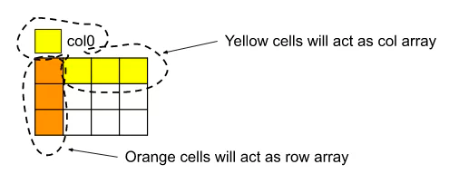

# Medium Array Problems:
Solution to all the medium level problems can be found at [MediumArrayProblems.java](MediumArrayProblems.java)

#### 1. [Two Sum](https://leetcode.com/problems/two-sum/)
Approach
* Bruteforce:
    * Traverse the array, pick the element, let's say x and search in the remaining array if 'target-x' is present
    * TC = O(N^2) & SC = O(N)
* Optimal:
    * Use a HashMap<Element, Index>. Traverse the array, check if 'target-x' (x is the current element) exists in the hashmap.
    * If yes then return the answer else put the element and index in hashmap
    * TC = O(N) & SC = O(N)

#### 2. [Two Sum - Variety 2](https://practice.geeksforgeeks.org/problems/key-pair5616/1?utm_source=gfg&utm_medium=article&utm_campaign=bottom_sticky_on_article)
Approach:
* Optimal:
    * The above approaches will also work but would not be optimal
    * Sort the array and use 2 pointer left and right. SUM(arr[LEFT], arr[RIGHT])
    * Increment left if sum > target
    * Decrement right if sum < target
    * TC = O(N) & SC = O(1)

#### 3. [Sort 0s, 1s, 2s](https://leetcode.com/problems/sort-colors/) - Dutch-National Flag Algorithm
Approach:
* Bruteforce:
    * Sort the array and any sorting algorithm
    * TC =  O(Nlog(N)) & SC = O(log(N))
* Better:
    * Use a HashMap to keep the count of 0, 1 and 2
    * TC = O(N) & SC = O(1)
* Optimal: Dutch-National Flag Algorithm
    * use 3 pointers low, mid and high
    * Everything between 0 and low-1 is 0
    * Everything between low to mid-1 is 1
    * Everything between high+1 to n-1 is 2
    * Assume entire array is sorted except for the part from mid to high
    * Based on the value of mid do the necessary.
    * TC = O(N) & SC = O(1)

#### 4. [Majority Element](https://leetcode.com/problems/majority-element/) - Moore's Voting Algorithm
The majority element is the element that appears more than ⌊n / 2⌋ times.  
Approach:
* Bruteforce:
    * Use nested for-loop, outer to traverse the array, inner to count the number of times element appears
    * TC = O(N^2) & SC = O(1)
* Better:
    * Use a HashMap to keep the track of element and its count.
    * TC = O(N) & SC = O(N)
* Optimal: Moore's Voting Algorithm
    * Take 2 variables element and count (count doesn't store count of the element).
    * Store the first element in element
    * Traverse the array, if the element encountered is same as element then increment the count, Otherwise decrement the count.
    * If the value of count goes negative, Change the value of element with the element encountered and reset count to 0
    * TC = O(N) & SC = O(1)

#### 5. [Maximum Subarray](https://leetcode.com/problems/maximum-subarray/) - Kadane's Algorithm
Given an integer array nums, find the subarray with the largest sum  
Approach:
* Bruteforce:
    * Use nested for-loops and calculate the sum of every sub array possible and return the largest one.
    * TC = O(N^2) & SC = O(1)
* Optimal: Kadane's Algorithm
    * Traverse the array and keep adding the sum.
    * Don't carry forward if the sum is negative.
    * And keep track of maximum
    * TC = O(N) & SC = O(N)

#### 6. [Best Time to Buy and Sell Stock](https://leetcode.com/problems/best-time-to-buy-and-sell-stock/)
* Approach:
    * Traverse the array and keep track of min.
    * When you encounter an element calculate profit and reassign min if the current element is lesser.
* TC = O(N) & SC = O(1)

#### 7. [Rearrange Array Elements by Sign](https://leetcode.com/problems/rearrange-array-elements-by-sign/)
Positives & Negatives are Equal.   
Approach:
* Bruteforce:
    * Use a Hashmap to keep track of positives and negatives and at last reassign and return.
    * TC = O(N) & SC = O(N)
* Optimal:
    * We need to use an extra space no matter what, But can we do it in one pass?
    * Use and auxiliary array and 2 pointers that would point to even indexes (positive number) and odd indexes (negative number)

#### 8. [Alternate positive and negative numbers](https://practice.geeksforgeeks.org/problems/array-of-alternate-ve-and-ve-nos1401/1)
The problem is similar to the one above but positives & negatives are not equal.  
Approach:
* Optimal:
    * This optimal approach for this variety is kind of same as bruteforce for the above one
    * TC = O(N) & SC = O(N)

#### 9. [Next Permutation](https://leetcode.com/problems/next-permutation/)
The next permutation of an array of integers is the next lexicographically greater permutation of its integer
* Approach:
    * The next permutation should have the longest prefix match with the current permutation.
    * Traverse from the back and see where the `num[i] < num[i+1]` satisfies. Then i would be our breakpoint.
    * All the elements from i+1 to n-1 will be in decreasing order for sure.
    * Traverse again from the back and find the element which is just greater than `num[breakpoint]` swap them.
    * Sort the sub-array from i+1 to n-1.
* TC = O(3N) ~ O(N) & SC = O(1)

#### 10. [Leaders in an array](https://practice.geeksforgeeks.org/problems/leaders-in-an-array-1587115620/1?utm_source=gfg&utm_medium=article&utm_campaign=bottom_sticky_on_article)
An element of array is leader if it is greater than or equal to all the elements to its right side.
* Approach
    * Traverse from right and keep count of max. Add the element to result array when max is reassigned.
    * Reverse the result and return.
* TC = O(N) & O(1)

#### 11. [Longest Consecutive Sequence](https://leetcode.com/problems/longest-consecutive-sequence/description/)
Approach:
* Bruteforce:
    * Sort the array and count the consecutive elements
    * TC = O(Nlog(N)) & SC = O(log(N))
* Optimal:
    * Put all the elements in a HashSet
    * Traverse the hashset. Let's say current element is x then check if x-1 exists
    * If yes then do nothing. If x-1 doesn't exists that means x is the first number of the consecutive sequence.
    * See how many numbers are there consecutive to x and store in count
    * So the same for all the elements in hashSet and keep track of the max count.
    * TC = O(N) for putting elements in hashset & O (2N) at worst for traversing in the hashset
    * TC = O(N) + O(2N) = O(3N) & SC = O(N)

#### 12. [Set Matrix Zeroes](https://leetcode.com/problems/set-matrix-zeroes/description/)
Approach:
* Bruteforce:
    * Use an auxiliary matrix and copy the original array in it.
    * Traverse the original array and if encounter 0 make the row and column 0 in auxiliary matrix.
    * O(N * M) & O(N * M)
* Better:
    * Instead of using an entire matrix use only an auxiliary row and auxiliary column
    * Mark the ith cell 0 in aux row if there is 0 in the ith column
    * Mark the ith cell 0 in aux column if there is 0 in the ith row
    * Traverse the matrix again and fill 0 based on the value of aux col & row.
    * TC = O(N * M) & SC = O(N + M)
* Optimal:
    * Instead of using an aux col & row use the 0th column and 0th row.
    * But we need to use an extra space because matrix[0][0] cannot keep track of row & column both.
    * So we will use 1 extra space for row[0]
    * 
    * Remember to the col0 use it at the last
    * TC = O(N * M) & SC = O(1)

#### 13. [Rotate Image (Matrix)](https://leetcode.com/problems/rotate-image/)
* Bruteforce:
    * Use an auxiliary 2D matrix to rotate
    * TC = O(N^N) & SC = O(N^2)
* Optimal:
    * Transpose the matrix
    * Reverse the matrix column wise
    * TC = O(N^2) & SC = O(1)

#### 14. [Spiral Matrix](https://leetcode.com/problems/spiral-matrix/description/)
* Approach:
    * This is an implementation problem.
    * Use 4 pointers left, right, top & bottom
    * Traverse from left -> right, top -> bottom, right -> left, bottom -> top
* TC = O(N^2) & SC = O(1)

#### 15. [Subarray Sum Equals K](https://leetcode.com/problems/subarray-sum-equals-k/)
Approach:
* Bruteforce:
    * Find all the sub arrays and check if their sum is equal to k
    * TC = O(N^2) & SC = O(1)
* Optimal:
    * Use a HashMap<Sum, CountOfTheSum> check if sum == K, If yes then increment ans
    * Check if sum-K exists in the hashmap. If yes than add the CountOfTheSum ans.
    * Return ans
    * TC = O(N) & SC = O(N)
