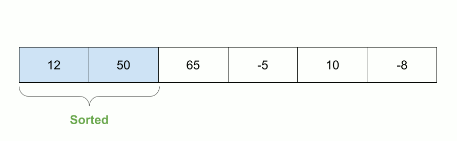
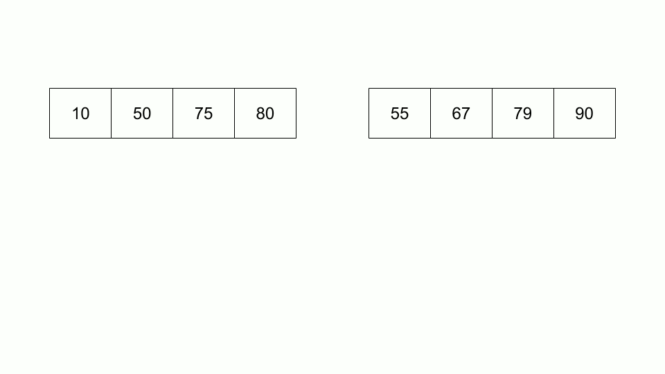
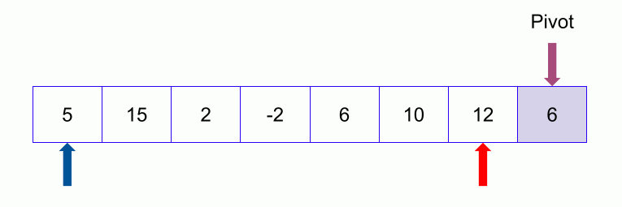
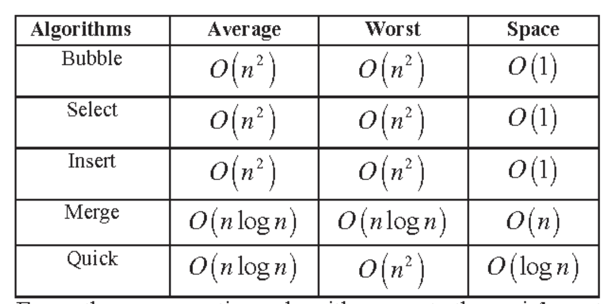

## Sorting Algorithms
#### 1. [Selection Sort](https://practice.geeksforgeeks.org/problems/selection-sort/1?utm_source=youtube&utm_medium=collab_striver_ytdescription&utm_campaign=selection-sort)
* Approach:
    * Traverse the array, select the minimum and put it at its correct position.
    * Do the above step until all the elements of the array are covered.
    * 
* TC = O(N^2) & SC = O(1)
* Code: [SelectionSort.java](SelectionSort.java)

#### 2. [Bubble Sort](https://practice.geeksforgeeks.org/problems/bubble-sort/1?utm_source=youtube&utm_medium=collab_striver_ytdescription&utm_campaign=bubble-sort)
* Approach:
    * Analogy: The largest bubble in the water comes on the top first.
    * In the same way, The largest element is moved to its the correct position by comparing with the neighbour element and swapping if required.
    * 
* TC = O(N^2) & SC = O(1)
* Code: [BubbleSort.java](BubbleSort.java)

#### 3. [Insertion Sort](https://practice.geeksforgeeks.org/problems/insertion-sort/0?category[]=Algorithms&page=1&query=category[]Algorithmspage1&utm_source=youtube&utm_medium=collab_striver_ytdescription&utm_campaign=insertion-sort)
* Approach:
    * Assume 2 arrays, left which is sorted and right which is unsorted
    * Traverse the array from left to right and insert the element you encounter at its correct position in the left array.
    * 
* TC = O(N^2) & SC = O(1)
* Code: [InsertionSort.java](InsertionSort.java)

#### 4. [Merge Sort](https://practice.geeksforgeeks.org/problems/merge-sort/1?utm_source=youtube&utm_medium=collab_striver_ytdescription&utm_campaign=merge-sort)
* Approach: It uses recursion (divide and conquer)
    * Divide the array till there is only one element left in a array
    * Merge the array in a sorted order
    * 
* TC = O(Nlog(N)) & SC = O(N)
* Code: [MergeSort.java](MergeSort.java)

#### 5. [Quick Sort](https://practice.geeksforgeeks.org/problems/quick-sort/1?utm_source=youtube&utm_medium=collab_striver_ytdescription&utm_campaign=quick-sort)
* Approach: It uses recursion (divide and conquer)
    * Chose a pivot, Move all the elements greater than pivot to right and all the elements lesser than pivot to its left.
    * Repeat the process on the left and right part of the pivot as well.
    * 
    * Any element can be chosen as pivot in the above image, last element is pivot but in the solution code first element is the pivot (don't get confused).
* TC = O(Nlog(N)) & SC = O(log(N))
* Code: [QuickSort.java](QuickSort.java)

#### Time Complexity Summary

References: Thanks to Shahad (https://blog.shahadmahmud.com/) for the GIFs of sorting algorithms.
